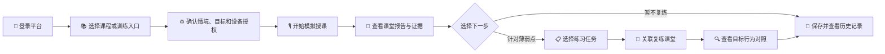
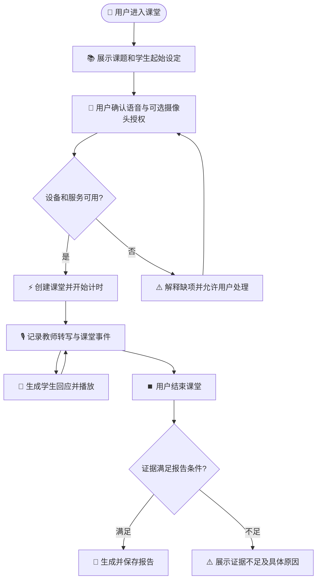

# 临客 LINK 产品需求文档

_版本 1.0 · 需求基线日期：2026-10-08 · 适用对象：产品、设计、前后端开发、测试与教研协作者_

---

## 📌 文档说明

本文件是临客 LINK 的独立产品需求文档（PRD），用于统一产品定位、目标用户、主要场景、功能要求、体验原则和验收口径。它综合项目 README、产品建设规划、前端 UI 交接和智能课堂升级规划编写。

需求状态按**截至 2026-10-08 的项目资料**整理。文中“现有”表示资料记录已有实现或入口；“规划”表示已提出但仍需结合当前代码和人工验收确认；“目标”表示产品应满足的要求。功能是否可对外使用，仍以当前部署、配置和验收结果为准。

| 字段 | 内容 |
| --- | --- |
| 产品名称 | 临客 LINK |
| 产品类型 | 面向教师教育的 AI 微格教学训练平台 |
| 当前核心课题 | 小学数学三年级《分数的初步认识》 |
| 主要交付形态 | 浏览器 Web 应用 |
| 需求基线 | 2026-10-08 |
| 文档状态 | 需求基线草案，可供产品、设计、研发评审 |
| 需求优先级 | P0：核心闭环；P1：能力增强；P2：后续扩展 |

## 🎯 产品概述

### 产品定位

临客 LINK 帮助师范生和职前教师在可重复的模拟课堂中练习教学技能。平台通过虚拟学生互动、语音交互、课堂事件记录和 AI 辅助评课，让用户回看课堂行为及证据，选择针对性练习，并在后续课堂中核验目标行为是否出现。

产品聚焦**教学练习与反思**，不替代真实课堂、指导教师判断或正式教师资格评价。当前主要训练情境是小学数学《分数的初步认识》；课程中心展示的其他技能或资源不等于已支持相应实时课堂情境。

### 用户问题与产品价值

| 用户问题 | 产品提供的价值 | 用户可观察到的结果 |
| --- | --- | --- |
| 缺少低成本、可重复的试讲机会 | 提供可重复进入的模拟课堂 | 用户可完成一次授课并查看课堂记录 |
| 学生回应不稳定，难练提问、追问和反馈 | 提供多名具有差异化设定的虚拟学生 | 用户可根据学生回应调整讲解和互动 |
| 课后反馈零散，难定位行为发生时刻 | 将课堂转写、学生回应、播放与可用视觉事件按时间组织 | 用户可从报告跳回具体事件或片段 |
| 评语难转化为下一次行动 | 将已验证问题转成可执行的练习目标 | 用户可选择任务进入复练，并查看目标行为证据 |
| AI 评分可能缺少依据或表达过度确定 | 将判断关联到事件和教学资料，缺证据时明确标注 | 用户能够区分观察、解释、未知和建议 |

### 产品目标与衡量方式

| 目标 | 衡量方式 | 口径说明 |
| --- | --- | --- |
| 用户可独立完成训练闭环 | 完成授课、查看报告、启动复练并查看对照的比例 | 区分正常完成、主动退出和系统失败 |
| 评课结果可核查 | 抽查报告结论中可回到有效课堂事件或教学来源的比例 | “存在引用”不等于“引用支持结论” |
| 建议可转化为行动 | 用户选择练习任务并完成关联复练的比例 | 单独报告任务完成数，不能据此宣称能力提升 |
| 产品稳定性可度量 | 课堂启动成功率、报告生成成功率、延迟分布和故障数 | 必须记录分母、环境和失败，不以合成验证代替真人验收 |
| 专业建议可信 | 教师复核的准确性、相关性、适用性和未知率 | 需保留复核范围和分歧，模型自评分不能替代专家意见 |

当前资料未给出生产级目标数值。团队完成基线测量、目标用户试用和教研复核后，再为指标设定数值门槛。

## 👥 用户与使用场景

### 目标用户

| 用户类型 | 主要目标 | 高频任务 | 当前产品关系 |
| --- | --- | --- | --- |
| 师范生 / 职前教师 | 练习教学表达、提问、候答、反馈和课堂组织 | 选择课题、试讲、查看反馈、重复练习 | 核心使用者 |
| 教师教育课程教师 / 指导教师 | 为学生提供可复核的练习反馈，检查练习证据 | 查看课堂与报告、复核建议、指导下一步练习 | 专业指导者；正式教师管理工作台不在当前范围 |
| 项目运营或维护者 | 维护课程资料、服务配置和运行安全 | 更新授权资料、检查服务、处理故障 | 当前以系统维护职责为主，不定义独立运营后台 |

产品当前不承诺机构级班级管理、批量作业布置、教务系统集成、组织权限、多租户隔离或校级数据看板。

### 典型用户旅程

### 主要使用场景

1. **首次练习**：用户进入课程或训练入口，查看本次课堂的课题和虚拟学生起始设定，完成设备与隐私授权后开始授课。
2. **实时互动**：用户通过语音向虚拟学生讲解、提问或点名；系统展示学生生成、等待播放、发言、取消或失败状态，并记录事件时间线。
3. **课后复盘**：用户结束课堂，查看报告生成状态、评分维度、课堂行为片段、证据和教学来源；证据不足时可看到缺失原因。
4. **针对性复练**：用户从报告中选择练习任务，进入关联课堂；结束后查看目标行为为已观察、未观察或证据不足。
5. **历史回看**：用户在个人成长区域查看历史训练、报告、任务状态和可用趋势信息。
6. **资源学习**：用户在资源库筛选资料，在站内阅读 PDF 或 Markdown 内容，并按需要下载原始文件。

## 🧭 产品范围与边界

### 当前版本范围

| 优先级 | 范围 | 需求说明 | 状态依据 |
| --- | --- | --- | --- |
| P0 | 账号与会话 | 登录、注册、退出、受保护页面的登录态失效处理 | 项目已有认证与会话计划；生产安全配置需另行验收 |
| P0 | 工作台与导航 | 提供训练入口、近期状态和主要功能导航 | 已有工作台页面与 UI 交接记录 |
| P0 | 课程与训练入口 | 展示课程/技能资料并进入训练；清晰标出实际支持的情境 | 课程中心已存在；实时课堂当前以单一分数课题为主 |
| P0 | 模拟课堂 | 语音输入、虚拟学生互动、播放反馈、状态提示和课堂记录 | 核心链路已实现，真机与真人验收边界须保留 |
| P0 | 证据型报告 | 生成状态、维度结论、有效事件、资料引用、失败和证据不足说明 | 已有课堂报告能力；报告语义质量仍需人工抽查 |
| P0 | 历史与个人成长 | 查看历史训练、报告、日志、资料和训练趋势 | 已有成长/个人中心入口，具体呈现以现有页面为准 |
| P1 | 虚拟学生情境状态 | 通过可验证的教学证据更新模拟学生的概念/误解状态 | 2026-10-04 规划记录了主路径实现；首期仅限样板情境 |
| P1 | 教学行为片段 | 从时间戳事件中识别提问、回应、反馈等片段并回放 | 已有行为分析主路径，识别准确性仍需标注样本和教师复核 |
| P1 | 练习任务与复练对照 | 从报告形成任务、关联复练课堂、按统一行为口径对照 | 已有任务主路径记录；建议合理性需教师验收 |
| P1 | AI 报告追问与异议重评 | 允许用户围绕报告继续提问或补充材料发起重评 | 项目已有独立追问、补充说明和报告版本相关记录 |
| P2 | 多课题和可配置量规 | 扩展学科/课题、教学目标、任务与评价量规配置 | 长期建设方向；新增情境需逐课题审核和独立验收 |

### 暂不纳入当前基线

- 将平台宣称为真实儿童学习效果测量、教师能力认证或标准化考试系统。
- 将模拟学生状态 `addressed` 解释成真实学习掌握。
- 默认录制、上传或长期保存完整课堂视频；本机录像产品化与云端录像不属于本 PRD 的 P0 要求。
- 机构管理后台、班级、教师批量管理、统一作业、校级报表、多租户和并发扩容。
- 未经验证的多课题实时教学、自动扩展课标知识或自动给出国家标准结论。
- 自动推断情绪、人格、学生真实认知或摄像头之外的行为。
- 将模型生成的分数作为唯一结论，或将分数上升直接解释为教学能力改善。

## 🔄 核心业务流程

### 开始课堂与实时互动

### 报告到复练

1. 报告完成后，系统依据有效报告维度和可用行为片段生成有限数量的练习候选；首期上限为 3 个。
2. 每个任务需说明关联维度、来源事件、目标行为和完成判据。证据不足时只能提供一般性练习，不得写成个人诊断结论。
3. 用户选择任务后，以该任务启动关联课堂；启动失败时任务保持可恢复状态，不伪装为已完成。
4. 复练结束后，系统按相同的行为规则和版本进行核对，结果为 `observed`、`not_observed` 或 `insufficient`。
5. 只有目标一致、证据口径一致且材料足够时才展示行为对照。不得把不可比的综合分相减或生成进步百分比。

## 🧩 功能需求

### 账号、导航与应用外壳

| ID | 优先级 | 需求 | 验收标准 |
| --- | --- | --- | --- |
| AUTH-01 | P0 | 用户可通过登录页进入本人受保护的训练和历史页面 | 未登录无法读取受保护数据；登录失败显示可理解错误，不误报为成功 |
| AUTH-02 | P0 | 用户可注册、退出并处理会话失效 | 退出后受保护页面不可继续展示旧用户内容；401 失效后清理会话并提供重新登录入口 |
| AUTH-03 | P0 | 登录和注册重复提交应受到控制 | 请求进行中不可重复提交；网络故障不能伪装成登录成功 |
| NAV-01 | P0 | 应用提供工作台、课程、训练/课堂、评课/报告、成长/个人中心和资源入口 | 用户可从主要导航进入对应页面，返回后不丢失已保存数据 |
| NAV-02 | P0 | 应用 shell 在桌面与移动视口下保持可用 | 窄屏下导航、内容区和主要操作可访问，不出现不可恢复的横向溢出 |
| NAV-03 | P1 | 工作台突出继续训练和近期进度，同时呈现数据来源 | 无历史数据时显示空状态；不以演示数据冒充真实用户记录 |

### 课程中心与训练准备

| ID | 优先级 | 需求 | 验收标准 |
| --- | --- | --- | --- |
| COURSE-01 | P0 | 用户可浏览课程/技能卡片、筛选并查看课程详情 | 每个课程至少展示名称、简介、学习/训练入口和支持状态 |
| COURSE-02 | P0 | 平台明确区分“资料可学习”和“可进入实时模拟课堂”的课题 | 当前未接入的课题不可显示为已支持实时训练；入口提供明确说明 |
| COURSE-03 | P0 | 用户开始训练前可以查看课题目标和情境信息 | 若情境提供学生起始状态，需明确这是模拟设定 |
| COURSE-04 | P1 | 训练准备页说明设备权限、语音/摄像头用途，以及各模式对设备的要求 | 权限请求由用户操作触发；拒绝权限时按当前模式的明确规则处理，不得绕过授权或隐瞒功能影响 |
| COURSE-05 | P1 | 训练前显示服务状态、准备结果和明确的下一步操作 | 状态检查失败说明原因；不会提供会绕过授权、预算或安全门槛的操作 |

### 模拟课堂

| ID | 优先级 | 需求 | 验收标准 |
| --- | --- | --- | --- |
| CLASS-01 | P0 | 用户可开始、暂停/继续（若当前情境支持）、结束课堂 | 状态和计时可见；重复结束或网络重试不会重复创建报告副作用 |
| CLASS-02 | P0 | 用户可通过语音输入教学内容，系统显示最终确认的转写 | 预览文本与最终转写明确区分；失败或迟到的旧结果不污染当前课堂 |
| CLASS-03 | P0 | 虚拟学生以可辨别的状态呈现思考、生成、等待播放、发言、取消和失败 | 状态变化可见；未完整播放或被打断的回应不作为完整学生发言证据 |
| CLASS-04 | P0 | 课堂事件按时间记录教师发言、学生回应、播放及可用动作/视觉信息 | 每个派生判断可回到原始事件或标明没有可用证据 |
| CLASS-05 | P0 | 用户可控制字幕、可用学生对象、课堂设置和全屏呈现 | 控件状态一致；设置变化不静默覆盖课堂已记录事实 |
| CLASS-06 | P0 | 设备或网络失败时提供可理解提示和可恢复路径 | 显示失败环节；停止时释放已打开设备；不将失败状态渲染为成功 |
| CLASS-07 | P0 | 录音、摄像头和云端处理的授权在用户操作前说明 | 用户确认前不请求相应设备；说明各设备是否为当前模式必需、供应商和用途，且与运行配置一致 |
| CLASS-08 | P1 | 课堂开始前展示虚拟学生的情境起始理解或误解 | 标注为“模拟情境状态”，不称为真实学生诊断 |
| CLASS-09 | P1 | 有效教学证据可改变对应虚拟学生的模拟概念状态 | 仅接受已确认转写及匹配课题的证据；拒绝/接受原因和事件 ID 可追溯 |
| CLASS-10 | P1 | 每个模拟状态变化记录版本、前后状态、原因及来源事件 | 课堂重连或历史查看时状态与事件链一致；相同输入和规则版本可重算 |

### AI 评课与证据报告

| ID | 优先级 | 需求 | 验收标准 |
| --- | --- | --- | --- |
| REPORT-01 | P0 | 用户可查看报告生成中的、成功、失败或证据不足状态 | 状态可恢复；刷新或重新进入后以后端状态为准 |
| REPORT-02 | P0 | 报告展示综合判断、维度结论、优点、问题和改进建议 | 评分口径在界面可查；非评分项可显示“暂不评分/证据不足” |
| REPORT-03 | P0 | 每个涉及课堂事实的结论关联有效事件、时间或明确限制 | 用户可定位原始事件；不完整播放、低置信度或无关学生事件不可补足证据 |
| REPORT-04 | P0 | 需要教学依据的结论展示来源、定位和适用范围 | 清楚区分官方标准、院校案例、经验资料和外部索引；资料不支持时不强行引用 |
| REPORT-05 | P0 | 报告展示证据覆盖、缺失项和不确定性 | 缺失说明具体到材料/维度；不得因为整体报告生成而掩盖局部未知 |
| REPORT-06 | P0 | 用户可以查看历史报告且数据按本人归属隔离 | 无权访问其他用户报告；加载失败不回退到演示数据 |
| REPORT-07 | P1 | 用户可对报告提出异议或补充说明，发起新版本重评 | 旧版本保留；失败不覆盖可查看的原报告；新版明确标识版本和生成状态 |
| REPORT-08 | P1 | 用户可针对当前报告继续追问 | 追问回答不改写原报告、综合分或维度分；历史问题只读取当前用户允许范围内的数据 |
| REPORT-09 | P1 | 报告展示教学行为片段，包括提问、学生完整回应、追问、反馈和小结等可支持类型 | 片段含时间范围、原始事件、规则/模型版本和证据质量；不足时标未知 |
| REPORT-10 | P1 | 板书、动作等视觉上下文只作为可观察证据展示 | 不从视觉数据推断情绪、人格或没有证据支持的教学质量 |

### 练习任务、复练与个人成长

| ID | 优先级 | 需求 | 验收标准 |
| --- | --- | --- | --- |
| PRACTICE-01 | P1 | 报告可生成 1–3 个可操作的练习候选 | 每项包含目标行为、关联维度、来源证据和完成判据；同一报告版本不会重复生成 |
| PRACTICE-02 | P1 | 用户可查看任务、选择任务并启动关联复练 | 任务和复练课堂均校验用户归属；页面可恢复任务状态 |
| PRACTICE-03 | P1 | 任务证据不足时提供通用练习而非个体诊断 | 界面说明任务为通用建议，不编造来源事件或薄弱点 |
| PRACTICE-04 | P1 | 复练完成后输出 `observed`、`not_observed` 或 `insufficient` | 同一目标和行为版本才可对照；系统延迟、无时间戳或播放不完整时按规则降为不足 |
| PRACTICE-05 | P1 | 成长页展示任务进度和两次课堂的目标行为证据 | 不以总分变化替代行为证据；不可比时明确显示“无法判断” |
| GROWTH-01 | P0 | 用户可查看个人资料、历史训练和可用报告 | 仅展示当前用户数据；空历史和加载失败状态明确区分 |
| GROWTH-02 | P1 | 趋势仅使用满足条件的本人有效历史报告 | 显示统计时间范围、数据数量和纳入规则；数据不足时不绘制误导趋势 |
| GROWTH-03 | P1 | 用户可从成长页回到原课堂、报告或练习任务 | 链接经过归属校验；已删除或不可读内容有明确说明 |

### 资源库

| ID | 优先级 | 需求 | 验收标准 |
| --- | --- | --- | --- |
| LIB-01 | P0 | 用户可按官方标准、实操清单、院校案例和外部资源筛选 | 分类标签与实际来源一致；外部链接不被标成已审核正文 |
| LIB-02 | P0 | 用户可在站内阅读 PDF 预览和 Markdown 资料 | 页面支持关闭、键盘 Esc、移动端阅读；阅读失败提供原文件入口（若可用） |
| LIB-03 | P0 | 用户可下载已获准提供的原始文件 | 下载名称和格式明确；不公开未授权私有语料全文 |
| LIB-04 | P1 | 资源显示来源、适用范围和许可/使用说明 | 来源性质或许可未知时不推断为可公开转载或可用于训练 |

## 🎨 体验与交互要求

### 视觉和布局

- 全局采用已交接的深色沉浸式视觉语言、圆角控制台结构、玻璃面板和橙紫强调色；不同业务页保持一致的标题、按钮、面板、悬停和聚焦状态。
- 应用外壳支持桌面端固定导航与工作区滚动；移动端改为适合窄屏的单列浏览和可触达控件。
- 模拟课堂优先保证文字、学生状态、计时、主要控制和错误提示清晰；动效不得遮挡授课或关键证据。
- 用户开启系统减少动态效果时，动画应降级为静态或轻量过渡。
- 保留键盘焦点可见、按钮状态可读、表单错误可识别等基本可访问性。

### 页面状态

所有主要页面至少定义以下状态，不能只实现理想成功路径：

| 状态 | 页面行为 |
| --- | --- |
| 首次加载 | 提供明确的加载反馈，不闪现旧用户或假数据 |
| 空数据 | 说明当前没有记录，并给出合适入口 |
| 无权限/登录过期 | 清理失效状态并提供重新登录路径 |
| 网络或服务失败 | 指出失败位置和下一步；可重试操作应明确且安全 |
| 部分证据不足 | 保留可用结论，同时显示不可判定项目和原因 |
| 进行中 | 防止重复提交，提供当前任务状态 |
| 成功 | 显示保存/完成状态和后续可执行操作 |

### 文案原则

- 使用“模拟学生”“模拟情境状态”“课堂证据”“AI 辅助建议”等准确表述。
- 将观察事实、模型解释和行动建议分开呈现，不把解释伪装成事实。
- 避免“学生已掌握”“教学能力提升”等无法从模拟状态或一次课堂证据直接推出的说法。
- 错误提示应说明当前发生了什么、用户能做什么、重试是否会产生费用或重复提交。
- 对实时语音、摄像头和第三方模型使用，使用与实际运行配置一致的说明。

## 🔒 数据、安全与隐私要求

| ID | 要求 | 验收口径 |
| --- | --- | --- |
| SAFE-01 | 用户只能读取、修改和追问自己的课堂、报告、任务与个人记录 | 所有资源按服务端用户归属校验；前端 ID 不能覆盖服务端授权 |
| SAFE-02 | 密钥和模型凭证只保存在服务端配置 | 浏览器资源、接口响应、日志和文档中不暴露凭证 |
| SAFE-03 | 摄像头和麦克风在用户授权后再使用 | 权限请求与页面进入分开；结束、失败或关闭功能后释放设备 |
| SAFE-04 | 说明语音、摄像头、转写、模型分析和保存用途 | 同意文案覆盖实际启用的供应商与数据流；供应商变更后重新确认 |
| SAFE-05 | 原始事件和派生分析保持可追溯 | 派生报告/行为/状态保存来源事件 ID、时间和规则或模型版本 |
| SAFE-06 | 不将私有资料自动公开或用于未授权模型训练 | 资料来源、用途、许可和导出范围可核对；链接不等于授权 |
| SAFE-07 | 日志与测试数据遵循最小化原则 | 不输出 token、密钥、未经授权的课堂正文或可识别个人数据 |
| SAFE-08 | 生产部署具备基础安全配置 | 强随机 JWT 密钥、关闭演示账号/启动种子、限制 CORS、HTTPS、登录限流和配置审查 |
| SAFE-09 | 数据保留和删除规则可被用户理解 | 产品上线前需确定课堂、转写、报告、视觉资料的保存期限、删除入口和备份策略 |

> SAFE-09 的保存期限和删除机制在现有资料中没有完整定义，正式开放前需形成明确策略。此处记录为待决需求，不擅自补充期限。

## ⚙️ 非功能需求

| 类别 | 需求 | 验收方式 / 限制 |
| --- | --- | --- |
| 兼容性 | 支持项目定义的桌面与移动端主流视口 | 在 320、620、900、1180、1440 px 等断点检查布局；目标浏览器清单由部署方补充 |
| 可用性 | 关键操作可见且有反馈，错误可恢复 | 对登录、开始课堂、结束课堂、生成报告和复练进行可用性走查 |
| 一致性 | 状态在刷新、重新进入和网络恢复后保持正确 | 以服务端持久状态为准；重复请求应幂等或安全失败 |
| 可追溯性 | 评分/行为/状态结论可回到事件、版本和资料来源 | 抽查端到端链路，缺失字段显示未知而非推测 |
| 延迟 | 记录语音端到端响应、报告等待和失败情况 | 在真人环境建立 P50/P95/最大值基线；当前不设未经测量的承诺值 |
| 可靠性 | 课堂中断、设备拒绝、供应商超时和模型失败可解释 | 覆盖失败路径并保留用户已保存的历史结果 |
| 成本控制 | 付费模型请求按用途/预算进行门控和记录 | 用户可识别付费功能；失败重试不重复结算；真实账单与估算分开 |
| 可扩展性 | 新情境可独立定义版本、课题和学生状态，不散落硬编码 | 新增情境需方案评审、独立知识审核和回归验收 |
| 无障碍 | 支持键盘操作、可见焦点、减少动态效果和清晰状态提示 | 重点表单、对话框、报告锚点和课堂控制需人工检查 |
| 运维 | 提供服务状态、错误定位和安全部署说明 | 运行文档不包含真实凭证；部署检查覆盖鉴权、网络与预算配置 |

## ✅ 验收场景

| 场景 ID | 操作 | 通过标准 |
| --- | --- | --- |
| AT-01 首次登录 | 注册/登录并进入工作台 | 成功时进入本人工作区；错误密码、网络故障和重复提交均有正确提示 |
| AT-02 未接入课题 | 从课程中心打开尚无实时情境的课程 | 用户能学习可用资料，但不会误认为可启动该课题课堂 |
| AT-03 完整课堂 | 授权设备、开始课堂、提问、学生回应、结束 | 关键状态和事件有时间顺序；完整播放事实可核验 |
| AT-04 权限拒绝 | 拒绝麦克风或摄像头权限 | 页面说明受影响功能及当前模式要求；不创建虚假的完整课堂；关闭资源按要求释放 |
| AT-05 打断回应 | 学生语音播放中被打断 | 被打断的回应不按完整互动计入报告；原始事件仍可回看 |
| AT-06 证据不足报告 | 结束一节数据不足的课堂 | 报告说明不足原因；不补造分数或引用，不阻止查看已保存记录 |
| AT-07 来源核查 | 打开一项带教学依据的报告结论 | 用户可检查来源标题、定位和适用范围；引用不支持时标明限制 |
| AT-08 模拟状态变化 | 有效讲解、无效确认和无关课题分别触发状态判断 | 只有符合情境规则的教学证据改变模拟状态；记录前后状态与事件来源 |
| AT-09 行为片段回放 | 打开提问、回应、追问或反馈片段 | 时间范围与原始事件一致；不支持的语义保持未知 |
| AT-10 练习与复练 | 选练习任务并完成关联课堂 | 任务归属正确；结果为观察到、未观察到或证据不足之一；不可比时不算分差 |
| AT-11 报告重评 | 补充说明并重新评课，随后模拟失败 | 原报告可继续查看；新版本有独立状态和失败说明 |
| AT-12 历史数据权限 | 尝试打开另一用户的报告或任务 | 服务端拒绝访问；页面不泄露被请求资源内容 |
| AT-13 刷新恢复 | 报告或任务处理中刷新并重新进入 | 页面恢复服务端最终状态，不重复创建或重复结算 |
| AT-14 移动端阅读 | 在窄屏打开资源、报告和课堂页面 | 内容可读，主要操作可触达，阅读器可关闭，布局无关键遮挡 |

自动化测试、合成浏览器流程、真实供应商联调、真人设备测试和教师专业复核应分别记录。通过其中一类不能自动推定其他类别已通过。

## 📦 交付建议与需求变更

### 交付拆分

1. **P0 基线**：登录和导航、课程状态区分、模拟课堂、证据型报告、历史查看、资源阅读、权限与错误状态。
2. **P1 训练闭环**：虚拟学生状态变化、行为片段、练习任务、复练关联和同口径证据对照、报告追问/异议处理。
3. **P2 扩展**：多课题、教学目标和量规配置、机构课程试点与经测量支持的规模化能力。

每次交付应标记：需求 ID、实现状态、自动验证结果、真人/教师验收状态、已知限制和回滚/迁移要求。规划文档或代码合并本身不代表产品验收完成。

### 变更规则

- 新需求需说明目标用户、要解决的问题、优先级、页面/接口影响、验收标准、隐私和成本影响。
- 新增课题必须补齐情境定义、知识来源、评价口径、反例和教师复核，不得只替换提示词后宣称支持。
- 会改变历史评分、报告数据、学生状态或事件口径的改动必须版本化，并定义旧数据兼容方案。
- 影响授权、外部模型、数据保存或预算门槛的改动须同步更新用户说明和运维文档。

## 📚 参考资料与待决事项

### 项目内参考资料

- [项目 README](../README.md)：产品定位、核心体验、课题边界与当前部署边界。
- [XH-202620 对标与建设规划](XH-202620-临客对标与建设规划-20260911.md)：目标用户、建设方向、能力缺口和长期规划。
- [前端 UI 调整交接说明](UI调整交接说明.md)：页面范围、视觉语言、响应式和资源库交互。
- [智能课堂升级实施规划](intelligent-classroom-p123-plan-20261004.md)：虚拟学生状态、行为片段、练习任务、复练和验收边界。
- [项目进度与更新日志](项目进度与更新日志-2026-09-05至2026-09-09.md)：认证、课堂、报告及历史功能记录；该文档包含历史快照，应结合更新资料阅读。
- [课堂运行说明](classroom-runbook.md)：运行、配置、服务边界与安全注意事项。
- [课堂资料来源记录](classroom-sources.md)：知识资料类别、来源和授权边界。
- [AI 评课设计规格](superpowers/specs/2026-09-10-b05-ai-review-design.md)：报告、追问、状态恢复、权限和失败处理细节。

### 待产品/教研/运营确认

| 问题 | 需要确认的内容 | 影响 |
| --- | --- | --- |
| 用户和机构范围 | 首期是个人自助、课程教师组织试用，还是机构部署 | 影响注册、班级、数据管理和权限设计 |
| 课题扩展顺序 | 《分数的初步认识》之后优先支持哪些课题 | 影响知识库、情境、测试集和课程页状态 |
| 报告评价口径 | 六维定义、量规来源、分数展示和不可评分规则 | 影响教师信任和历史可比性 |
| 数据保存 | 转写、课堂事件、视觉截图/摘要、报告的保存时间和删除方式 | 影响隐私说明、存储、备份和合规流程 |
| 费用体验 | 哪些课堂/追问/重评会调用收费服务，预算提示如何展示 | 影响授权、重试和成本预期 |
| 真人验收 | 目标浏览器、设备、课堂时长、教师复核流程和通过门槛 | 影响是否可对外开放和稳定性声明 |
| 可访问性 | 色彩对比、字号、字幕、键盘完整操作的目标标准 | 影响视觉验收和用户覆盖 |
| 管理能力 | 是否需要教师、班级、任务分发和机构数据报表 | 属于超出当前个人产品范围的产品决策 |

---

_维护说明：当产品范围、课堂事件口径、权限、数据保存策略或评价量规发生变化时，应同步更新本 PRD，并在需求变更记录中注明受影响的需求 ID。_
