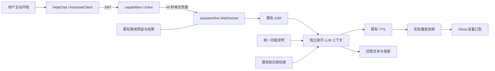

# 临客 LINK 技术更新：沉浸课堂、数字人助手与图检索

- 日期：2026-10-08
- 版本：`2026.10.08-immersive-assistant`
- 整理基线：`c6480da`（本轮开始时的 `origin/main`）
- 范围：本次工作区全部功能更新、资产、测试、许可与产品文档。

## 1. 更新摘要

| 模块 | 本次结果 | 主要实现 |
| --- | --- | --- |
| 视觉与动效 | 保留深色、紫橙渐变、玻璃面板；恢复原布局并加入透视、光影、轻量背景与分组进入 | `ambient-effects.css`、`ambientUi.js`、`motionPreferences.js`、`AmbientVideo.vue` |
| 模拟课堂 | 授课大屏优先，说明收进课前准备；三名真实 3D 学生、动作状态与录像合成 | `ClassroomPreparation.vue`、`StudentStage3D.vue`、`studentStageEngine.js`、`classroomCompositor.js` |
| 页面与模型 | 重复大标题改读屏标题；课程、资源、成长、评课直接呈现核心功能；模型无操作栏，直接把玩 | `functional-ui.css`、`InteractiveModel.vue`、`ModelShowcase.vue` |
| 数字人 | Olivia 半身、无框悬浮、紫橙灯光、眨眼与基础音频口型；失败显示同人物封面 | `DigitalHuman.vue`、`digitalHumanEngine.js`、本地 VRM/WebP |
| 助手问答 | 独立文字及连续语音会话、知识库引用、打断与资源释放；复用当前供应商及预算 | `assistant_routes.py`、`assistant_dialogue.py`、`assistantClient.js`、`HelpChat.vue` |
| 新手导览 | 首次欢迎、跳过、重看、按账号和版本记录；跨页定位，不自动启用设备 | `OnboardingTour.vue`、`onboarding.js` |
| 个人中心 / 设置 | 工作区内居中，最大 1040px；双栏 / 窄屏单栏，修正对比度和滚动位置 | `ProfileView.vue`、`functional-ui.css` |
| 登录 | 后端无明确消息时区分服务故障与账号失败，避免含糊的通用提示 | `authValidation.js` |
| 知识库 | 来源可核验的轻量图检索、请求级开关、原文路径、失效过滤与评测修正 | `backend/rag/graph_*`、`rag_eval_graph.py`、`RagKnowledgeView.vue` |
| 交付资料 | 更新 PRD、依赖清单、资产来源、阶段验收及本篇技术交接 | `docs/`、`deploy/third-party/`、`VERSION.json` |

## 2. 设计与实现决策

### 2.1 在原视觉上增强

恢复原主卡片、胶囊导航与可拖动资源墙；不引入另一套页面主题。工作台人物使用现有 Cesium Man 的几何、骨骼和动画，替换显示材质及灯光。轻量背景视频从约 31.63MB 降至 3.14MB，使用 720p、24fps、H.264、faststart，无音轨。

共享动效偏好处理系统减少动态、页面可见性及触屏状态。普通卡片倾斜上限 4°、主卡片 6°、磁吸按钮位移不超过 4px；火花只在交互期间绘制。资源拖拽位移与内层透视分开，拖动时暂停倾斜。

模拟课堂路由继续以 `route.path` 保持组件身份，变更会话参数不重建摄像头、录音器或学生舞台。摄像画面、字幕、计时不参与装饰透视。

### 2.2 三学生共用一个渲染器

Kenney 模型映射为小明、小雨、小林，小林追加眼镜。三个视口共用一个 WebGL 画布；学生姓名、回复、点名仍用 HTML。姿态根据举手、思考、真实音频播放与音量状态变化。

录像复用当前学生帧缓存，不创建第二个学生渲染器。模型首次加载、单角色失败及 WebGL 失败分别有图片回退。默认约 30fps，低性能档 20fps；不可见时暂停，卸载清理资源。

### 2.3 模型融入功能区域

书册放入课程筛选区、档案放入资源分类区、轨道放入成长趋势卡、棱镜放入评课选择区域。移除旋转 / 展开 / 复位操作栏，直接横向拖动旋转、点击切换、双击复位；键盘左右键、Enter/Space、Home 等效。纵向触摸保留滚动，拖后抑制点击。交互收敛后停止刷新，减少动态效果时直接更新静态结果。

工作台问候压缩为一行；各页保留读屏一级标题与导航中的页面名称。授权、错误、加载状态、评分依据继续显示，详细解释迁入导览、助手及可展开详情。手机提供页面切换选择框，数字人默认放在页头，避开主屏与学生。

## 3. 数字人和助手架构

架构决策见 [ADR-006](decisions/006-vrm-independent-assistant.md)。



### 接口

| 接口 | 鉴权 / 输入 | 结果 |
| --- | --- | --- |
| `GET /api/assistant/capabilities` | JWT | 文字与语音可用性、服务商、最长会话和静默时限 |
| `POST /api/assistant/ticket` | JWT；`mode: text / voice` | 45 秒有效、单次使用的凭据；新凭据替换同账号旧凭据 |
| `WS /api/assistant/live` | 首帧交换凭据，凭据不进入 URL | `ready`、识别、回答、音频、来源、取消、状态和错误 |

每条会话使用随机 `session_id`，每次回答使用 `turn_id`。客户端按两者丢弃过期事件和取消后的音频。真实 ASR 开始说话事件触发打断；关闭面板、页面隐藏、退出账号及开始 / 恢复课堂会停止助手采集和播放。课堂采集中仅提供文字助手。

默认中文；最长 5 分钟，静默 60 秒结束，回答播放期间不计静默。每账号一个连接，全局最多五个连接，每会话最多 40 次提问。仍采用原单进程、线程化服务部署方式。

助手不创建课堂记录，不参与评分。上下文只保留在连接及页面内存；仅在用户主动保存时通过原训练日志接口保存。语音与问题发送至现有配置服务，沿用原费用预留及结算；供应商和费用上限未调整。

系统回答依据 `backend/data/assistant-guide.json`，dev/build 前由同步脚本生成前端副本；教学回答复用知识库，来源 ID 限定于本次候选集合。无有效依据时明确无法确认。Olivia 口型使用实际播放幅度，不宣称中文音素级同步。

## 4. GraphRAG 与质量开关

来源与取舍见 [ADR-005](decisions/005-source-grounded-graphrag.md)。不增加图数据库或新表，实体、关系及 schema 存入现有 `kb_chunks.extra.graph`。图节点和边通过受控词表及正文 cue 生成，返回路径绑定实际切片；请求分类、文档范围、ready、启用及失效条件继续约束候选。

- 新增 `KnowledgeGraphIndex`，与原向量 / BM25 召回通过 RRF 融合并进入原精排；相似度证据门槛保持不变。
- 新增 `python -m rag.cli graph-rebuild`，只重建图 JSON，不调用 Embedding。
- `graph` 请求参数必须为布尔值；新增 `RAG_GRAPH_ENABLED=false`、深度与扩展数配置。图检索失败回退原链路并返回诊断。
- 缓存采用内容指纹，避免同秒跨进程修改遗漏；原文接口拒绝过期或未就绪文档。
- 知识库页增加路径和原文查看，修正方向、切片 ID、证据不足提示与长文本溢出。
- 评测补齐 Recall、MRR、无答案、来源有效性和耗时记录。

**保持 `RAG_GRAPH_ENABLED=false`。** 独立小库验收中，原黄金集通过率 68.75%、图问题召回 60%，未达到 80%；路径来源校验虽为 100%，但不能代表检索质量达标。直接问题 MRR 由 0.643 降至 0.479。此次发布提供可控能力，不能将图检索描述为已经带来召回提升。

完整数据范围、独立 MySQL 验收和失败原因见 [GraphRAG 本机验收](rag/graphrag-local-acceptance-2026-10-08.md)。其中数据库、凭据及真实运行记录保留在忽略目录，不随 GitHub 分发。

## 5. 开源来源与资产

| 来源 | 许可 | 用途 |
| --- | --- | --- |
| [Three.js](https://github.com/mrdoob/three.js) | MIT | 复用现有运行库，人物、学生与程序化模型渲染 |
| [Khronos / Cesium Man](https://github.com/KhronosGroup/glTF-Sample-Assets/tree/main/Models/CesiumMan) | CC BY 4.0 | 工作台人物；本地保留署名、哈希与改编说明 |
| [Kenney Mini Characters](https://kenney.nl/assets/mini-characters) | CC0 | 三名学生与眼镜，仅保留必要动画和资产 |
| [pixiv/three-vrm](https://github.com/pixiv/three-vrm) 3.5.5 | MIT | VRM0、标准化骨骼、眨眼与口型 |
| [PolygonalMind/100Avatars](https://github.com/PolygonalMind/100Avatars/tree/master/100Avatars_056) | Olivia 元数据 CC0 | Olivia 1.0，约 1.70MB；本地透明封面约 10KB |
| [Vue Bits](https://github.com/DavidHDev/vue-bits) | MIT + Commons Clause | ClickSpark、Magnet 改编及 TiltedCard 思路；完整额外条款随包保留 |
| [Motion for Vue](https://github.com/motiondivision/motion-vue) | MIT | 复用现有 motion-v，局部过渡与连续反馈 |

没有引入 TalkingHead 或 OpenAvatarChat 的第二套人物 / 语音服务。书册、档案、轨道、棱镜是项目程序化模型。资产本地部署，运行时不向外部模型库请求人物。

依赖锁文件、完整许可证、来源和 SHA-256 见 `deploy/third-party/` 及各模型目录。`scripts/export_dependency_inventory.py` 已同步依赖清单。

## 6. 启动、升级与回退

前后端应一起更新：

```powershell
git checkout main
git pull --ff-only origin main
npm ci --prefix frontend
python -m pip install -r backend/requirements.txt
npm run build --prefix frontend
./scripts/start-classroom.ps1 -PythonPath C:/Python314/python.exe
```

保留已有 `.env` 和数据库。新助手复用原 ASR、LLM、TTS、JWT 和预算配置，无须新增商业服务密钥；不要用 `.env.example` 覆盖本机配置。新文档 / 资产随代码部署，无数据库表迁移。启动脚本复用已健康的进程，所以升级运行中的后端时需先按原运行手册有序重启，再确认 `/api/health` 与登录后的助手 capabilities。

本次远端合并不等于生产部署。生产仍需要 HTTPS/WSS、原有来源限制与单进程约束；本机 WebSocket 代理已完成首次凭据握手检查。

若需回退整次交付，按最终 PR 的 merge commit 执行 `git revert -m 1 <merge-commit>`，重新安装锁定依赖并构建、重启。该操作不回滚用户数据。GraphRAG 可保持关闭；助手语音故障时使用文字问答或离线 FAQ；WebGL 故障自动显示图片。

## 7. 验收与已知边界

### 发布整理回归

使用仓库 `scripts/run-regression.ps1 -PythonPath C:/Python314/python.exe` 统一运行后端全量测试、前端测试和生产构建，全部检查通过：

| 检查 | 结果 |
| --- | --- |
| 后端全量 `backend/tests` | 306 passed、1 skipped，60.68 秒；跳过项和依赖警告保留在原始日志 |
| 前端 `npm test` | 170 项通过，0 失败 |
| 前端生产构建 | 通过；保留现有大分块提示 |

执行日志保留在 `artifacts/private/regression-release-20261008.json`，不提交运行日志或私有数据。

前一阶段已确认前端 170 项、助手及课堂后端相关 175 项通过；GraphRAG 阶段另有相关回归和独立 MySQL 验收。阶段结果不是全量结果的替代。

### 浏览器、性能与语音

- 已检查 1440×900、1280×720、768×1024、375×812 的主要布局；个人中心在工作区内居中，模型无操作栏，窄屏无整页横向溢出。
- 导览首次入口、跳过、重看、跨页定位与账号隔离已覆盖；不会自动启用摄像头、麦克风、授权或课堂。
- WebGL 失败时数字人 / 学生回退图片，FAQ 和文字入口仍可用；减少动态、不可见暂停、重复卸载和资源释放有测试及浏览器记录。
- 前台合成录像采样：页面约 53.3fps，学生约 29.3fps；有效录像 8 秒（墙钟 10 秒中暂停 2 秒），含一条音轨及三名学生画面。没有达到早期整页 55fps 目标。
- Olivia 10 秒采样约 26.4fps，JS 更新与渲染提交约 0.36ms/帧；隐藏和减少动态状态下新增帧为 0。CPU 提交耗时不代表 GPU 完整耗时。
- 合成提问经真实讯飞 ASR → DeepSeek → 讯飞 TTS 成功。单次总耗时 7.97 秒，输入（含 2 秒静音尾帧）发送结束后 2.287 秒收到回答音频。
- 真实麦克风、扬声器回声、实体触屏及长时间授课仍需设备验收；构建保留 Three.js / 图表公共包大于 500kB 的提示。

## 8. 文档导航

- 当前数字人、接口、隐私与导览：[ui-assistant-onboarding.md](ui-assistant-onboarding.md)
- 原版视觉恢复与来源：[ui-effects-integration.md](ui-effects-integration.md)
- 首轮动效验收：[ui-effects-acceptance.md](ui-effects-acceptance.md)
- 课堂大屏与学生阶段：[classroom-ui-upgrade.md](classroom-ui-upgrade.md)
- 程序化模型阶段：[ui-interactive-models.md](ui-interactive-models.md)
- 知识库架构与运维：[rag/README.md](rag/README.md)

较早阶段中的机器人形象、模型操作栏与性能数值保留为历史记录；当前行为以本篇及数字人文档为准。
